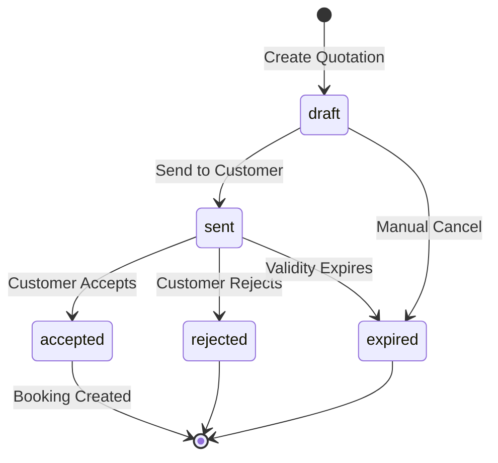
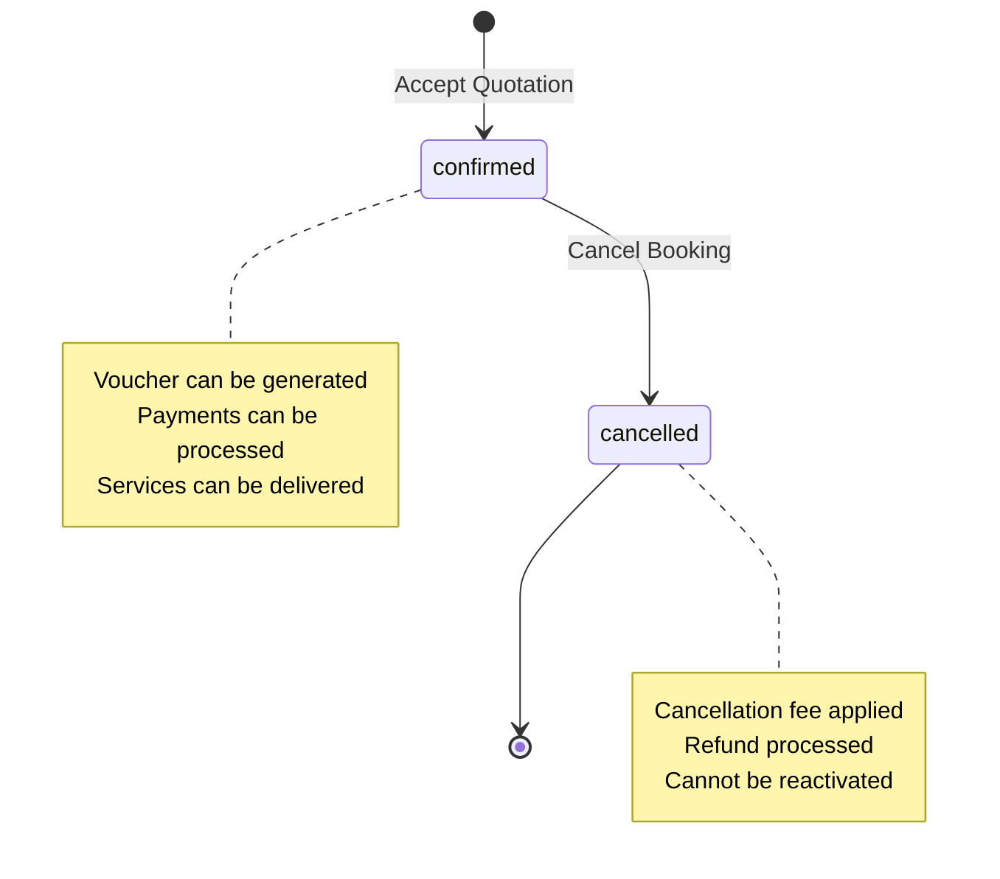

# State Machines Documentation

**Last Updated**: November 6, 2025
**Version**: 1.0
**Phase**: 5 - Booking Lifecycle

---

## Table of Contents

1. [Quotation State Machine](#quotation-state-machine)
2. [Booking State Machine](#booking-state-machine)
3. [State Transition Rules](#state-transition-rules)
4. [API Endpoints by State](#api-endpoints-by-state)
5. [Error Handling](#error-handling)

---

## Quotation State Machine

### States

The quotation lifecycle consists of 5 distinct states:

| State | Description | Terminal | Can Book? |
|-------|-------------|----------|-----------|
| `draft` | Initial state when quotation is created | No | No |
| `sent` | Quotation has been sent to customer | No | No |
| `accepted` | Customer accepted the quotation | Yes | Yes |
| `rejected` | Customer rejected the quotation | Yes | No |
| `expired` | Quotation validity period has passed or manually cancelled | Yes | No |

### State Diagram



### State Transitions

#### 1. **draft → sent**

**Trigger**: Agent sends quotation to customer

**API**: `PUT /api/quotations/{id}/status`
```json
{
  "status": "sent"
}
```

**Preconditions**:
- Quotation must have at least one itinerary day
- Customer email must be valid
- Total price must be > 0

**Side Effects**:
- Email notification sent to customer (future)
- `valid_from` set to NOW()
- `valid_to` set to NOW() + 7 days (default)

---

#### 2. **sent → accepted**

**Trigger**: Customer accepts quotation OR agent marks as accepted

**API**: `PUT /api/quotations/{id}/status`
```json
{
  "status": "accepted"
}
```

**Preconditions**:
- Quotation must be in `sent` state
- Quotation must not be expired (`valid_to` > NOW())

**Side Effects**:
- **Automatically creates a booking** (see Booking State Machine)
- Locks exchange rate at current value
- Generates unique booking number
- Sets `accepted_at` timestamp
- Transitions quote to `accepted` state

**Implementation**: `src/app/api/quotations/[id]/status/route.ts` lines 84-130

---

#### 3. **sent → rejected**

**Trigger**: Customer rejects quotation OR agent marks as rejected

**API**: `PUT /api/quotations/{id}/status`
```json
{
  "status": "rejected"
}
```

**Preconditions**:
- Quotation must be in `sent` state

**Side Effects**:
- No booking created
- Quotation marked as terminal state
- Optional: Capture rejection reason

---

#### 4. **sent → expired**

**Trigger**: Automatic expiration when `valid_to` date passes OR manual cancellation

**API**: `PUT /api/quotations/{id}/status` (manual)
```json
{
  "status": "expired"
}
```

**Automatic Trigger**: Background job checks `valid_to` dates (future implementation)

**Preconditions**:
- For automatic: `NOW() > valid_to`
- For manual: Any state except `accepted`

**Side Effects**:
- Quotation marked as terminal state
- No booking created

---

#### 5. **draft → expired**

**Trigger**: Manual cancellation by agent

**API**: `DELETE /api/quotations/{id}`

**Preconditions**:
- Quotation must not be `accepted`

**Side Effects**:
- Sets `status = 'expired'` (soft delete)
- Quotation removed from active views

---

### Allowed Operations by State

| Operation | draft | sent | accepted | rejected | expired |
|-----------|-------|------|----------|----------|---------|
| View | ✅ | ✅ | ✅ | ✅ | ✅ |
| Edit | ✅ | ✅ | ❌ | ❌ | ❌ |
| Duplicate | ✅ | ✅ | ✅ | ✅ | ✅ |
| Reprice | ✅ | ✅ | ❌ | ❌ | ❌ |
| Edit Itinerary | ✅ | ✅ | ❌ | ❌ | ❌ |
| Send | ✅ | ❌ | ❌ | ❌ | ❌ |
| Accept | ❌ | ✅ | ❌ | ❌ | ❌ |
| Reject | ❌ | ✅ | ❌ | ❌ | ❌ |
| Cancel | ✅ | ✅ | ❌ | ❌ | ❌ |

---

## Booking State Machine

### States

The booking lifecycle consists of 2 states (simple state machine):

| State | Description | Terminal | Can Cancel? |
|-------|-------------|----------|-------------|
| `confirmed` | Booking is active and confirmed | No | Yes |
| `cancelled` | Booking has been cancelled | Yes | No |

### State Diagram



### State Transitions

#### 1. **[none] → confirmed**

**Trigger**: Quotation is accepted

**API**: `PUT /api/quotations/{id}/status` with `status: "accepted"`
OR: `POST /api/bookings` with `quotation_id`

**Automatic**: Yes (when quotation is accepted)

**Preconditions**:
- Quotation must be in `sent` state
- Quotation must not be expired
- Quotation must not already have a booking

**Side Effects**:
- Creates booking record with unique `booking_number` (format: `BK-YYYYMMDD-XXXXX`)
- Locks exchange rate at current value
- Sets `status = 'confirmed'`
- Updates quotation `status = 'accepted'`
- Generates `created_at` timestamp

**Implementation**:
- `src/lib/booking-lifecycle.ts` - `createBookingFromQuotation()` function
- `src/app/api/quotations/[id]/status/route.ts` lines 84-130

---

#### 2. **confirmed → cancelled**

**Trigger**: Agent or customer cancels booking

**API**: `POST /api/bookings/{id}/cancel`
```json
{
  "cancellation_reason": "Customer request",
  "force_cancel": false
}
```

**Preconditions**:
- Booking must be in `confirmed` state
- Travel start date must be in the future (unless `force_cancel = true`)
- User must have `bookings:delete` permission

**Side Effects**:
- Sets `status = 'cancelled'`
- Sets `cancelled_at = NOW()`
- Sets `cancelled_by_user_id = current_user`
- Calculates cancellation fee based on policy
- Stores `cancellation_fee` and `cancellation_reason`
- Creates entry in `booking_cancellations` table
- Applies cancellation policy:
  - 60+ days before: 10% penalty
  - 30-59 days: 25% penalty
  - 14-29 days: 50% penalty
  - 7-13 days: 75% penalty
  - 0-6 days: 100% penalty (no refund)
- Marks `refund_status = 'pending'` for processing

**Implementation**: `src/app/api/bookings/[id]/cancel/route.ts`

---

### Allowed Operations by State

| Operation | confirmed | cancelled |
|-----------|-----------|-----------|
| View | ✅ | ✅ |
| Generate Voucher | ✅ | ❌ |
| Update Status | ✅ | ❌ |
| Cancel | ✅ | ❌ |
| Process Payment | ✅ | ❌ |
| Process Refund | ❌ | ✅ |

---

## State Transition Rules

### Business Rules

#### Quotation Rules

1. **One-Way Transitions**: Once a quotation reaches a terminal state (`accepted`, `rejected`, `expired`), it cannot transition to any other state.

2. **Booking Creation**: A booking is **only** created when a quotation transitions to `accepted` state.

3. **Validity Enforcement**: A quotation cannot be accepted if:
   - `valid_to < NOW()` (expired by date)
   - `status = 'expired'` (manually expired)
   - `status = 'rejected'` (already rejected)

4. **Modification Lock**: Quotations in `accepted`, `rejected`, or `expired` states **cannot be modified**. To make changes:
   - Duplicate the quotation
   - Make modifications to the duplicate
   - Send new quotation to customer

5. **Soft Delete**: Deleting a quotation sets `status = 'expired'`, not hard delete. Data remains for audit trail.

#### Booking Rules

1. **Terminal State**: Once a booking is `cancelled`, it **cannot be reactivated**. Customer must create a new booking.

2. **Cancellation Window**: Bookings can only be cancelled before travel starts, unless `force_cancel = true` (admin override).

3. **Cancellation Policy**: Fee calculation is **automatic** based on days before travel:
   ```javascript
   days_before_travel = ceil((travel_start_date - cancellation_date) / 1 day)
   ```

4. **Voucher Restriction**: PDF vouchers can only be generated for `confirmed` bookings.

5. **Immutable Data**: Once cancelled, booking data (including cancellation fee) is **immutable** for compliance.

---

## API Endpoints by State

### Quotation Endpoints

| Endpoint | Allowed States | Effect |
|----------|---------------|--------|
| `GET /api/quotations` | All | List quotations |
| `GET /api/quotations/{id}` | All | View quotation |
| `POST /api/quotations` | - | Create quotation (→ `draft`) |
| `PUT /api/quotations/{id}` | `draft`, `sent` | Update quotation |
| `DELETE /api/quotations/{id}` | `draft`, `sent` | Soft delete (→ `expired`) |
| `PUT /api/quotations/{id}/status` | `draft`, `sent` | Change status |
| `POST /api/quotations/{id}/duplicate` | All | Create copy (→ `draft`) |
| `POST /api/quotations/{id}/reprice` | `draft`, `sent` | Recalculate pricing |
| `GET /api/quotations/{id}/itinerary` | All | View itinerary |
| `PUT /api/quotations/{id}/itinerary` | `draft`, `sent` | Update itinerary |

### Booking Endpoints

| Endpoint | Allowed States | Effect |
|----------|---------------|--------|
| `GET /api/bookings` | All | List bookings |
| `GET /api/bookings/{id}` | All | View booking |
| `POST /api/bookings` | - | Create booking (→ `confirmed`) |
| `PATCH /api/bookings/{id}` | `confirmed` | Update status |
| `POST /api/bookings/{id}/cancel` | `confirmed` | Cancel booking (→ `cancelled`) |
| `GET /api/bookings/{id}/voucher` | `confirmed` | Generate PDF voucher |

---

## Error Handling

### State Transition Errors

#### Error Codes

| Error Code | HTTP Status | Description |
|------------|-------------|-------------|
| `INVALID_STATE_TRANSITION` | 409 Conflict | Transition not allowed from current state |
| `QUOTATION_EXPIRED` | 410 Gone | Quotation validity period has passed |
| `BOOKING_ALREADY_EXISTS` | 409 Conflict | Quotation already has a booking |
| `BOOKING_ALREADY_CANCELLED` | 409 Conflict | Booking is already cancelled |
| `CANNOT_MODIFY_ACCEPTED_QUOTE` | 403 Forbidden | Cannot modify accepted quotation |
| `TRAVEL_DATE_PASSED` | 400 Bad Request | Cannot cancel after travel start |

#### Example Error Responses

**Attempting to accept expired quotation**:
```json
{
  "error": {
    "code": "QUOTATION_EXPIRED",
    "message": "Cannot accept quotation that has expired",
    "details": [
      {
        "field": "valid_to",
        "issue": "expired",
        "message": "Quotation expired on 2025-11-01"
      }
    ],
    "request_id": "req_abc123"
  }
}
```

**Attempting to cancel already cancelled booking**:
```json
{
  "error": {
    "code": "BOOKING_ALREADY_CANCELLED",
    "message": "Booking is already cancelled",
    "details": [
      {
        "field": "status",
        "issue": "invalid_state",
        "message": "Current status: cancelled"
      }
    ],
    "request_id": "req_xyz789"
  }
}
```

**Attempting to modify accepted quotation**:
```json
{
  "error": {
    "code": "CANNOT_MODIFY_ACCEPTED_QUOTE",
    "message": "Cannot modify quotation in 'accepted' state",
    "details": [
      {
        "field": "status",
        "issue": "immutable",
        "message": "Duplicate the quotation to make changes"
      }
    ],
    "request_id": "req_def456"
  }
}
```

---

## Implementation Notes

### Validation Checks

Before any state transition, the system validates:

1. **Authentication**: User has required permission
2. **Current State**: Transition is allowed from current state
3. **Preconditions**: All business rule preconditions are met
4. **Data Integrity**: Foreign keys and references are valid

### Audit Trail

Every state transition is logged to `audit_logs` table:

```sql
INSERT INTO audit_logs (
  organization_id,
  user_id,
  action,
  resource_type,
  resource_id,
  changes,
  metadata,
  created_at
) VALUES (
  1,
  42,
  'QUOTATION_UPDATED',
  'QUOTATION',
  '123',
  '{"status": "accepted", "previous_status": "sent"}',
  '{"quote_number": "Q-2025-0123", "booking_id": 456}',
  NOW()
);
```

### Transaction Safety

Critical state transitions use database transactions:

- **Quote Accept + Booking Create**: Single atomic transaction
- **Booking Cancel + Fee Calculation**: Single atomic transaction
- **Itinerary Update + Price Recalc**: Single atomic transaction

If any operation in the transaction fails, **all changes are rolled back**.

---

## Testing Scenarios

### Quotation Flow

1. **Happy Path**: draft → sent → accepted → booking created ✅
2. **Rejection Path**: draft → sent → rejected (terminal) ✅
3. **Expiration Path**: draft → sent → expired (by date or manual) ✅
4. **Early Cancel**: draft → expired (soft delete) ✅

### Booking Flow

1. **Happy Path**: created (confirmed) → voucher generated → travel completed ✅
2. **Early Cancel**: confirmed → cancelled (60+ days, 10% fee) ✅
3. **Late Cancel**: confirmed → cancelled (3 days, 100% fee) ✅
4. **After Travel**: confirmed → cannot cancel (error) ✅

### Error Cases

1. **Accept Expired Quote**: sent (expired) → error 410 ✅
2. **Cancel Cancelled Booking**: cancelled → error 409 ✅
3. **Modify Accepted Quote**: accepted → error 403 ✅
4. **Double Booking**: accept same quote twice → error 409 ✅

---

## Migration Path

### Existing Data

For quotations/bookings created before Phase 5:

1. **Quotations without status**: Default to `draft`
2. **Bookings without status**: Default to `confirmed`
3. **Missing valid_to dates**: Set to `created_at + 7 days`

### Backwards Compatibility

All existing API endpoints continue to work:
- `POST /api/bookings` still creates bookings directly
- `PUT /api/quotations/{id}` still updates quotations
- No breaking changes to existing functionality

---

## Future Enhancements

### Planned State Additions

#### Quotation States (Future)
- `pending_approval` - Internal approval required before sending
- `negotiating` - Back-and-forth with customer on price

#### Booking States (Future)
- `pending_payment` - Waiting for customer payment
- `partially_paid` - Partial payment received
- `fully_paid` - Full payment received
- `completed` - Travel completed, ready for review

### Planned Transitions (Future)
- **Auto-expiration job**: Cron job to expire quotations past `valid_to` date
- **Payment webhooks**: Transition booking state based on payment gateway callbacks
- **Review system**: Transition to `completed` after travel end date

---

**Document Version**: 1.0
**Last Updated**: November 6, 2025
**Maintained By**: Development Team
**Phase**: 5 - Booking Lifecycle
